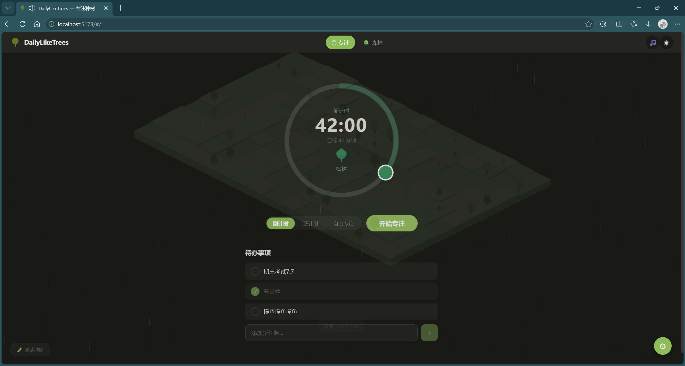
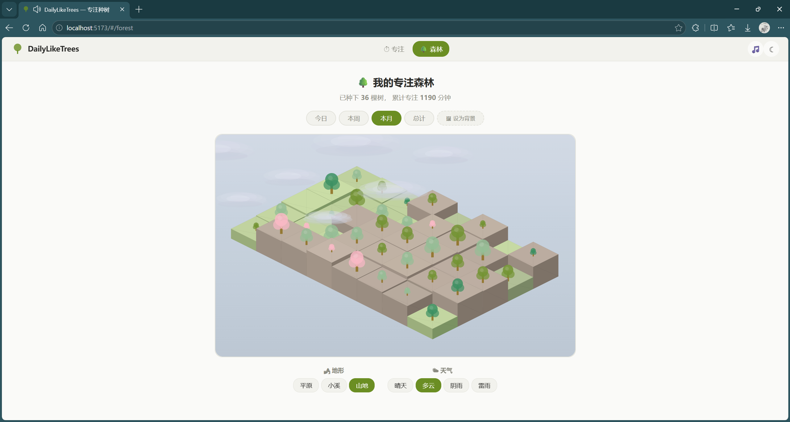
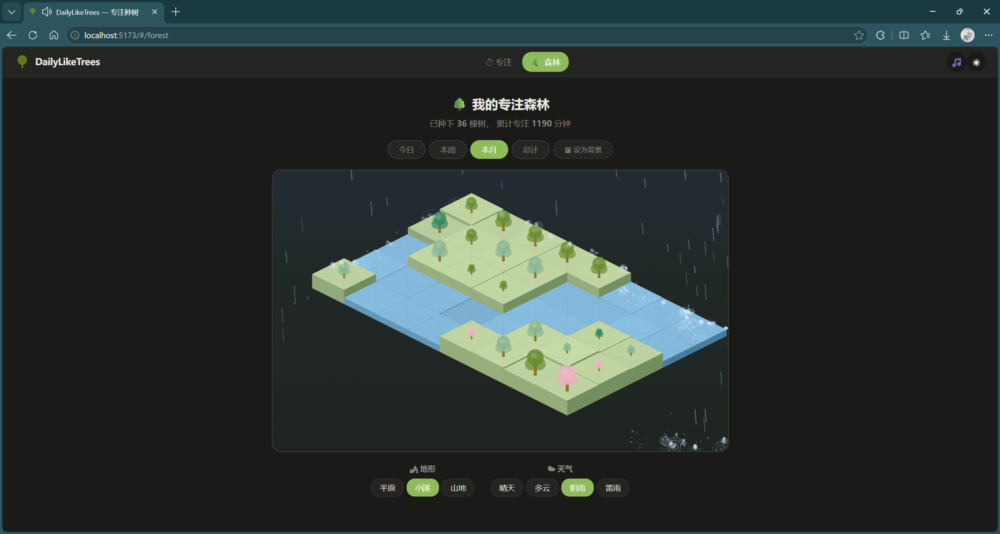
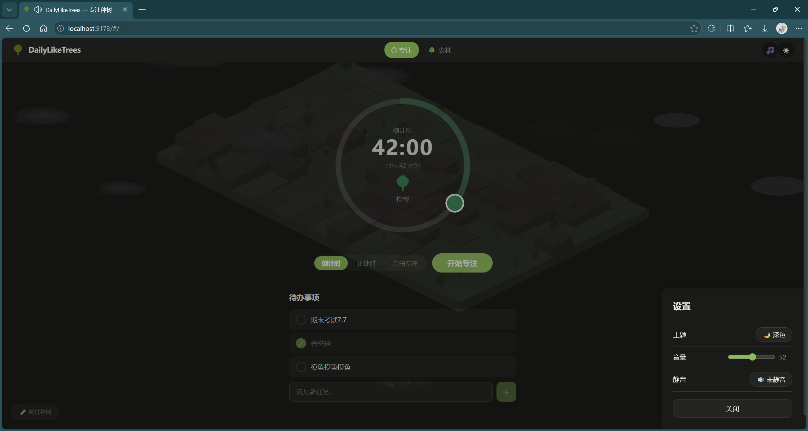

<div align="center">


# 🌳 DailyLikeTrees · 如树日常

*日复一日，如树般生长。每一次专注，都在你的森林里种下一棵树。*

[](https://vuejs.org/)
[](https://www.typescriptlang.org/)
[](https://vitejs.dev/)
[](https://fastapi.tiangolo.com/)
[](https://pixijs.com/)
[](LICENSE)

</div>

---

## ✨ 这是什么？

**DailyLikeTrees（如树日常）** 是一款受 Forest专注森林 启发的多平台专注辅助应用。

设定一个专注目标 → 完成它 → 在你的等距「专注森林」中种下一棵树。日积月累，终成一片林。

> 🖥️ 当前开发阶段：**Web 桌面端 MVP**

---

## 🎯 核心功能

- ⏱️ **智能计时器** — SVG 环形拖拽设时（15~120 分钟），支持倒计时 / 正计时 / 自由模式
- 🌳 **专注森林** — PixiJS 驱动的等距（Isometric）森林渲染，树木从地块中生长而出
- 🎨 **动态天气** — 晴天 · 多云 · 雨天 · 雷雨，全局天气效果覆盖整个界面
- 🏔️ **多变地形** — 平原 / 溪流 / 山地，柏林噪声驱动的高低错落地块
- 🎵 **环境音混音** — Web Audio API 多层环境音（雨声 / 溪流 / 风 / 森林）实时混合
- 🎹 **BGM 播放** — 内置舒缓背景音乐，专注更沉浸
- 🌓 **深色 / 浅色主题** — 全局 CSS 自定义属性驱动，天气颜色随主题自适应
- 📋 **待办记事** — 完整的 Todo CRUD，专注同时管理任务
- 🖼️ **森林背景** — 将任意时间段的森林设为主页动态背景
- 📱 **PWA 就绪** — Hash 路由 + 响应式布局

---

## 🖼️ 预览

| 主页（计时器 + 待办） | 专注森林（等距视图） |
|:---:|:---:|
|  |  |

| 雨天效果 | 深色主题 |
|:---:|:---:|
|  |  |

---

## 🛠 技术栈

| 层 | 技术 | 说明 |
|----|------|------|
| **前端框架** | Vue 3 + Composition API | `<script setup>` + TypeScript |
| **状态管理** | Pinia | 5 个 Store 模块（timer/todos/forest/audio/settings） |
| **构建工具** | Vite 8 | 极速 HMR |
| **森林渲染** | PixiJS 7.4 | WebGL 等距 2D 渲染 |
| **音频引擎** | Web Audio API | 多层环境音 + BGM 实时混音 |
| **后端框架** | FastAPI | Python 异步 Web 框架 |
| **数据库** | SQLite3 + SQLAlchemy | 轻量级，零配置 |
| **类型验证** | Pydantic v2 | 请求/响应 Schema |

---

## 🚀 快速开始

### 前置要求

- **Node.js** ≥ 18
- **Python** ≥ 3.10
- **npm** ≥ 9

### 1. 克隆仓库

```bash
git clone https://github.com/2678725875-dot/DailyLikeTrees.git
cd DailyLikeTrees
```

### 2. 启动后端

```bash
cd backend

# 创建虚拟环境（推荐）
python -m venv .venv
source .venv/bin/activate   # Windows: .venv\Scripts\activate

# 安装依赖
pip install -r requirements.txt

# 启动服务（端口 8000）
uvicorn app.main:app --reload
```

访问 [http://localhost:8000/docs](http://localhost:8000/docs) 查看 Swagger API 文档。

### 3. 启动前端

```bash
cd frontend
npm install
npm run dev
```

访问 [http://localhost:5173](http://localhost:5173) 即可使用。

> ⚠️ 两个服务需要**同时运行**。前端的 API 请求通过 Vite 开发服务器代理到后端 8000 端口。

### 4. 生产构建

```bash
cd frontend
npm run build      # TypeScript 类型检查 + Vite 构建
```

构建产物在 `frontend/dist/` 目录下，可直接部署到任意静态托管服务。

---

## 📁 项目结构

```
DailyLikeTrees/
├── frontend/                          # Vue 3 + Vite 前端
│   ├── public/assets/
│   │   └── audio/                     # 音频素材（环境音 + BGM）
│   │       ├── ambiance/              # rain / thunder / creek / wind / forest
│   │       └── music/                 # calm-1 / calm-2 / calm-3
│   └── src/
│       ├── components/
│       │   ├── timer/                 # CircularTimer / TreePreview / TreeSpeciesPicker
│       │   ├── board/                 # TodoBoard / TodoItem / TodoAddForm
│       │   ├── forest/                # IsometricGrid / BackgroundForest / ForestStats ...
│       │   ├── audio/                 # AudioControlPanel
│       │   ├── settings/              # SettingsPanel
│       │   └── layout/                # AppShell / AppHeader
│       ├── composables/               # useAudioEngine / useCircularTimer ...
│       ├── stores/                    # Pinia: timer / todos / forest / audio / settings
│       ├── services/                  # Axios API 封装
│       ├── types/                     # TypeScript 类型定义
│       ├── utils/                     # 等距坐标 / 素材路径 / 树木生长 / 常量
│       ├── views/                     # HomeView / ForestViewPage
│       └── styles/                    # CSS 变量 / 主题 / 基础样式
│
├── backend/                           # FastAPI + SQLite3 后端
│   └── app/
│       ├── models/                    # ORM: FocusSession / PlantedTree / Todo / UserSetting
│       ├── schemas/                   # Pydantic 请求/响应模型
│       ├── routers/                   # sessions / trees / todos / settings
│       ├── services/                  # 业务逻辑层
│       └── utils/                     # 树木成长阶段计算
│
├── CLAUDE.md                          # Claude Code 项目指引
└── README.md                          # 本文件
```

---

## 🔌 API 概览

| 方法 | 端点 | 说明 |
|------|------|------|
| `POST` | `/api/sessions` | 完成一次专注 → 种下一棵树 |
| `GET` | `/api/sessions` | 获取最近会话列表 |
| `GET` | `/api/trees?filter=today\|week\|month\|total` | 获取森林树木 + 统计 |
| `GET/POST` | `/api/todos` | 待办列表 / 创建待办 |
| `PATCH/DELETE` | `/api/todos/{id}` | 更新 / 删除待办 |
| `PUT` | `/api/todos/reorder` | 重排待办顺序 |
| `GET/PUT` | `/api/settings` | 读写用户设置 |

### 树木成长阶段 （目前对应贴图未完成 仅体现在树木大小）

| 专注时长 | 阶段 |
|----------|------|
| 0–14 分钟 | 🌱 种子 |
| 15–29 分钟 | 🌿 萌芽 |
| 30–59 分钟 | 🪴 树苗 |
| ≥ 60 分钟 | 🌳 大树 |

---

## 🎵 音频素材

项目音频文件来自 [Freesound.org](https://freesound.org)，均为 CC0 许可。

音频文件较大（~47MB），建议克隆后确认 `frontend/public/assets/audio/` 下的文件完整。

如需替换为自己的音频：
1. 将 MP3 文件放入对应目录（`ambiance/` 或 `music/`）
2. 编辑 `frontend/src/utils/assetPaths.ts` 更新路径映射
3. 推荐参数：环境音 96–128kbps 单声道，BGM 128–192kbps 立体声

---

## 🤝 贡献

欢迎提交 Issue 和 Pull Request！当前处于 Web MVP 阶段，后续计划包括：

- [ ] 优化各类图片素材和用户交互界面美观性
- [ ] 移动端适配（React Native / Flutter）
- [ ] 多人专注房间
- [ ] 更多树种 & 自定义森林主题
- [ ] 专注统计 & 周报
- [ ] 浏览器扩展（屏蔽 distracting 网站）

---

## 📄 许可

MIT License — 详见 [LICENSE](LICENSE) 文件。

---

<div align="center">

**🌳 每一棵树，都见证了你专注的时光。**

Made with ❤️ by [Ultraism](https://github.com/2678725875-dot)

</div>